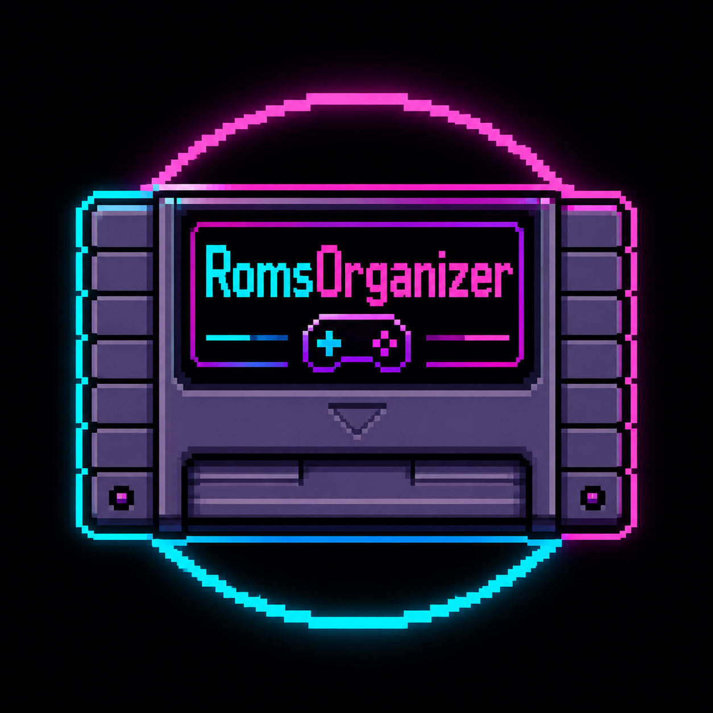

<div align="center">
  
  <h1>RomsOrganizer</h1>
  <p><b>Pulizia e riordino delle ROM per Batocera</b> · <i>ROM cleanup & tidy for Batocera</i></p>
</div>

---

## 🇮🇹 Italiano

RomsOrganizer è un'app per **Batocera** che trova e rimuove le ROM duplicate dalle
tue liste, con **backup e ripristino** integrati. Si installa da GitHub e compare
nel menu **PORTS**, navigabile col controller (interfaccia pygame in stile arcade).

### Cosa fa
- **File doppi (stesso nome)** — `Game.zip` + `Game (1).zip`, copie sparse.
- **Formati diversi** — stesso gioco in `.cue/.bin` e `.chd`: tieni quello che vuoi.
- **Regioni/revisioni (1G1R)** — `Mario (Japan)` vs `Mario (Europe)`: scegli **a mano**.
- **Gamelist** — rimuove voci doppie e orfane, riordina alfabeticamente.
- **Riordino** — pulisce i nomi mostrati e sposta le ROM nel sistema giusto.

### Sicurezza
- **Non cancella mai**: i duplicati vengono spostati nella cartella `ROM eliminate`.
- **Ripristino** completo da menu (registro `manifest`).
- **Anteprima (dry-run)** prima di ogni operazione: vedi cosa farà, poi confermi.

### Installazione
Da terminale Batocera (SSH o console):
```sh
curl -L https://raw.githubusercontent.com/masimoneext-sketch/RomsOrganizer/main/install.sh | sh
```
Poi: **Menu → Impostazioni giochi → Aggiorna lista giochi**.
Trovi *RomsOrganizer* nella sezione **PORTS**.

### Comandi
| Azione | Controller | Tastiera |
|---|---|---|
| Muovi | D-pad / stick | frecce / WASD |
| Conferma | A (configurabile) | Invio |
| Indietro | B (configurabile) | Esc |
| Scegli "tieni" | X | Spazio |

Al **primo avvio** col controller parte la configurazione tasti (come RGSX).

---

## 🇬🇧 English

RomsOrganizer is a **Batocera** app that finds and removes duplicate ROMs from your
game lists, with built-in **backup and restore**. Installs from GitHub and shows up
in the **PORTS** menu, controller-friendly (arcade-style pygame UI).

### Features
- **Duplicate files** (same name), **format variants** (`.cue/.bin` vs `.chd`),
  **region/revision** duplicates (1G1R, **manual** pick), **gamelist** cleanup
  (duplicate/orphan entries + sorting), **tidy** (clean names, move ROMs to the
  right system).

### Safety
- **Never deletes**: duplicates are moved to the `ROM eliminate` folder, with full
  **restore** from the menu and a **dry-run preview** before every action.

### Install
```sh
curl -L https://raw.githubusercontent.com/masimoneext-sketch/RomsOrganizer/main/install.sh | sh
```
Then **Menu → Game settings → Update game list**, find *RomsOrganizer* under **PORTS**.

---

## 🛠️ Sviluppo / Development

Il **motore** (`RomsOrganizer/core/`) è Python puro, senza pygame: testabile ovunque.

```sh
python3 tests/selftest.py     # crea ROM finte e verifica i 4 motori + backup/restore
```

La **UI** (`RomsOrganizer/ui/`) usa pygame ed è un guscio sopra il motore.

```
RomsOrganizer/
├── core/        motore: scanner, dedup, backup, tidy, config, models
├── ui/          pygame: app (schermate), controls, theme, strings
├── i18n/        traduzioni it/en
└── assets/      logo
```

> Requisiti: Python 3 (incluso in Batocera) e pygame (di norma già presente).

## 🎵 Musica / Credits

Musica di sottofondo (attivabile/disattivabile dal menu **Musica: ON/OFF**):

> **"Climbers In The Dark"** by **Nihilore** — licensed under
> [CC BY 4.0](https://creativecommons.org/licenses/by/4.0/).
> Source: [Free Music Archive](https://freemusicarchive.org/music/Nihilore/it-is-still-happening-it-should-not-be-happening/climbers-in-the-dark/).

Vedi [assets/CREDITS.md](RomsOrganizer/assets/CREDITS.md).

## Licenza
Codice: MIT — non affiliato a Batocera, RetroBat o RGS.
Musica: CC BY 4.0 (vedi sopra).
